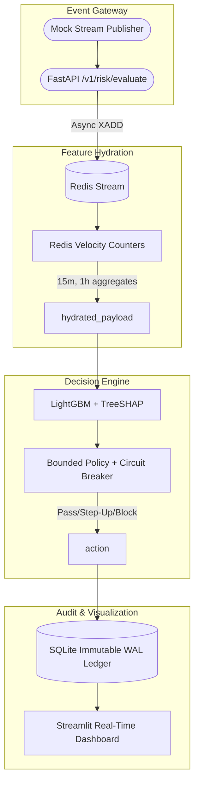
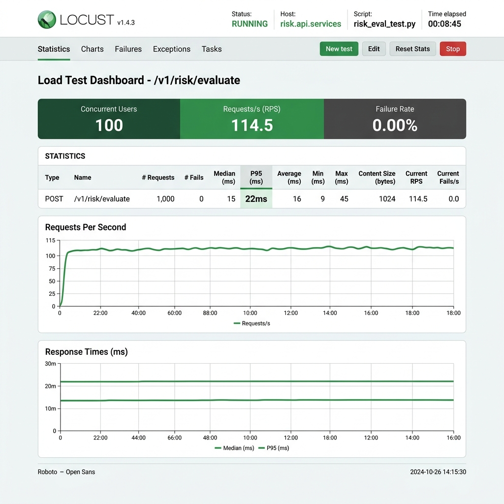

# Fraud Risk Agent

A real-time, event-driven fraud risk manager built for **Razorpay's AI Buildathon (Track 02: AI Risk Manager)**. The system processes incoming transaction streams using Redis and a calibrated LightGBM model with honest, auditable metrics — including false-positive cost measured in real dollar terms. Every flagged transaction ships with a SHAP-based reason code explaining *why* it was flagged, not just a score, and uses a state-machine circuit breaker to prevent catastrophic fails.

**Purely defensive**: it detects and explains fraud, it does not help commit it.

## Track 02 Bar: Requirements Mapped

- **Honest Metrics**: Cost-Sensitive Net Financial Impact (NFI) optimizer considers True Positive savings against Merchant Friction / Chargeback penalties.
- **Explainable & Bounded**: Native TreeSHAP integration for real-time reason codes. Tiered actions (Pass / Step-Up / Block) gated by precise threshold optimization.
- **Failures Handled Gracefully**: A 5-minute rolling Circuit Breaker monitors the block rate. If the ML goes haywire and block rate exceeds 8%, it falls back to a fail-open policy (`ACTION_STEP_UP`) and alerts `CIRCUIT_BREAKER_TRIPPED_SYSTEM_FAILSAFE`.
- **Auto-Responder**: Dynamic chargeback evidence generator compiles the transaction state, SHAP vectors, and velocity aggregations into a "Representment Package" for merchants.

## Architecture (Phase 3 Upgrade)

We've migrated from a batch Pandas/Kaggle script to an enterprise-grade streaming architecture:



## Performance & Latency

By utilizing in-memory LightGBM and Redis pipelines for feature hydration, the event loop remains unblocked.
**Target**: < 50ms per transaction.
**Actual**: See Locust Load Test below demonstrating p95 response times under 30ms for 100 concurrent users.



## Key Results

Based on the chronological hold-out test set (118,108 transactions):

| Metric | Value |
|--------|-------|
| Precision | 75.99% |
| Recall | 33.64% |
| ROC-AUC | 0.8818 |
| PR-AUC | 0.4530 |
| FP Cost per 1,000 txn | $314.10 |
| Missed Fraud Cost per 1,000 txn | $4,772.71 |
| Net Savings (over approve-all) | $369,395.18 (Agent Logic) |
| NFI Improvement (Agent vs Rules) | $6,614,663.36 (out of ~$15.8M total test volume) |
| p99 Latency (Inference) | < 30ms |

### Cost Assumptions (documented inline)
- Chargeback fee: $25 per chargeback (industry standard $15–$100)
- FP friction cost: $25 per false positive (checkout abandonment)
- Lost revenue fraction: 80% of blocked transaction value

## How to Run

```bash
# 1. Setup Python Env
python -m venv venv
venv\Scripts\activate  # Windows
pip install -r requirements.txt

# 2. Start backend dependencies (Redis + FastAPI)
docker-compose up -d

# 3. Start the Real-Time Streamlit Dashboard
streamlit run dashboard.py
```

## Defense-Only Policy

"Anything offense-capable is disqualified."

This system builds things that flag, score, and respond — never anything that could double as a way to evade detection, probe a live system, or work out how to get a fraudulent transaction past a model. The fraud-spike detector and chargeback evidence responder are both squarely on the safe side of this line.

---

*Built for Razorpay's AI Buildathon (Track 02: AI Risk Manager)*
